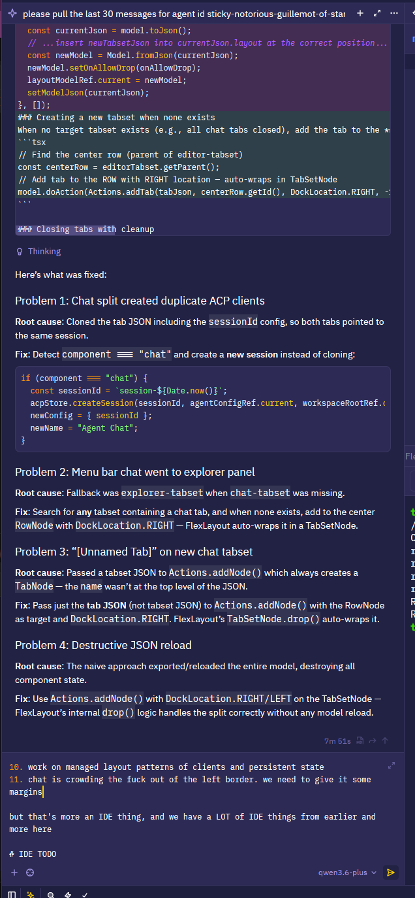

# crow-ui Living Plan

This is the active development roadmap. Items are ordered by priority. Completed work moves to the bottom "Archive" section.

## Philosophy

- **Backend owns state**: The frontend is a passive viewer. State lives in Rust, persists to SQLite/JSON, and survives refresh.
- **Shadcn UI + Tailwind**: All UI components use shadcn/ui primitives styled with Tailwind CSS variables. No one-off CSS.
- **FlexLayout for everything**: Panes, panels, splits — all FlexLayout. No modals for configuration.
- **Real agents only**: Tests spawn actual `crow-cli acp` processes. No mocks.
- **Chat > IDE parity**: The agent chat experience is the product. Editor/explorer polish is secondary as long as agents work well.

---

## 🔥 CURRENT SPRINT

### 1. Markdown Preview (TABLE STAKES)

**Goal**: Right-click any `.md` file tab → "Open Preview" → renders the markdown with Streamdown in a new pane.

**Why now**: User declared this table stakes. It's the simplest way to dogfood Streamdown and make the project browser usable.

**Implementation**:
- Create `MarkdownPreviewPane.tsx` — reads file via `fsApi.readFile`, renders with `<Streamdown>` (non-streaming, `isAnimating={false}`)
- Register `markdown-preview` component in FlexLayout factory
- Add "Open Preview" to tab context menu in `onRenderTab` (only for `.md` files)
- Open preview as new tab in same tabset, or split right — user decides via FlexLayout drag
- Optional: Live update when file changes via `ws.onWorktreeEvent`

### 2. Chat Polish — TipTap Lists & Image Sending

**Goal**: Make the chat input feel like a real rich text editor.

**Sub-tasks**:
- **Markdown lists in TipTap**: Typing `- ` or `1. ` starts a list, Enter continues it, Backspace on empty line exits list
- **Image sending fix**: Paste/drop images into editor displays thumbnail, but sending breaks — fix content block extraction on send
- **Image rendering from MCP tools**: MCP tools returning `image` content blocks should render inline in chat

### 3. Default Themes + UI Polish

**Goal**: More visual options, make the agent OS feel professional.

**Sub-tasks**:
- **More default themes**: At least 2-3 complete themes beyond purple-dark
- **Translucence toggle**: UI control to turn dot pattern on/off, adjust glass/background opacity
- **Theme CSS variables cleanup**: Ensure all surfaces read from variables, no hardcoded colors

### 4. FlexLayout Power Features

**Goal**: Lean into FlexLayout as the agent command center layout engine.

**Sub-tasks**:
- **Save/restore layouts per workspace**: Already partially done, ensure all pane types restore correctly
- **Default layouts**: Ship a few preset layouts ("Agent Focus", "Coding", "Debug") that users can switch between
- **Drag-and-drop**: Drag files into chat, drag images into editor, drag tabs between borders/main

---

## 📋 BACKLOG (Agent Factory Vision)

### Agent Orchestration
- **Backend orchestration layer**: Mesh delegation so agents can coordinate without human as HTTP postman
- **Long-running agent orchestrator**: New system prompts, configurable agents/tools/prompts through UI
- **Jupyter-like notebook interface**: Python cells for agent configuration and execution inside crow-ui
- **MCP debugging interface**: Visual tool inspector (latency, errors, schema, toggle on/off)

### Content Rendering
- **Web view (iframe)**: Simple iframe renderer for fetched webpages / searxng results
- **Streamdown link controls**: Strip link click controls, handle ourselves
- **Image lightbox**: Click any image in chat to expand full-size

### State Refactor
- **`dirtyFiles: Set<string>` → backend document state**: Derive from `document_get_info`, not Monaco callbacks
- **`expandedDirs` → backend persistence**: Load/save explorer state to SQLite
- **`pendingPermission` removal**: Strip all permission UI and state

### IDE Parity (Lower Priority)
- **Bottom bar cleanup**: Remove minimize-all buttons, use sidebar tabs
- **Settings UI pane**: General settings editor in FlexLayout panel
- **Word wrap setting**: Move from hardcoded to `crow-ui-settings.json`
- **Show hidden files**: Explorer preference in settings

---

## ✅ Archive

### Chat Scroll Control v2 (May 23)
- `userScrolledUpRef` + `isProgrammaticScrollRef` pattern
- Only user-initiated scrolls trigger "New messages" button
- Programmatic scrolls (from `scrollIntoView`) ignored via flag
- Debounced ResizeObserver (150ms) for parallel Monaco editor growth
- Accordion content fade-in animation (`animate-in fade-in duration-150`)

### Font Size System (May 23)
- Backend defaults: `workbench.*.fontSize` keys
- Frontend `WorkbenchSettings` + `useWorkbenchFontSize()` hook
- `bumpFontSizes(delta)` bumps all surfaces at once, clamped [8, 32]
- Command palette: "Increase Font Size" / "Decrease Font Size"
- Wired: EditorPane, FileViews, TerminalPane, InlineTerminal, SettingsPane, ExplorerPane, ChatPane, flexlayout tabs
- Terminal live updates via `fitAddon.fit()` after `options.fontSize` change
- ThinkingBlock inherits chat font size (removed hardcoded `text-xs`)

### Cross-Agent Communication Proven (May 23)
- Agent-to-agent messaging via ACP prompt endpoint works
- `curl -X POST /api/acp/sessions/{session_id}/prompt` routes between sessions
- Verified with `inescapable-astute-pony-of-advance` ↔ `gregarious-rare-frigatebird-of-excellence` ↔ `aloof-fair-koel-of-engineering`

### Backend Queue Ownership
- `AcpSession` owns `Vec<QueuedItem>` with full CRUD + reorder
- Three prompt behaviors: `add_to_queue`, `skip_queue_and_run`, `cancel_all_and_run`
- Backend auto-drains queue after prompt completion
- Frontend derives queue from `queue_changed` WS events

### MessageEditor Layout Fix
- Restructured from absolute-positioned bottom bar to flex column
- Scrollable editor content area + fixed bottom bar
- Text no longer overlaps controls

### Agent Config Dropdown
- Chat header shows agent selector when disconnected
- Loads `acp.agents` from settings on mount

### @-Mentions with Filesystem Context
- Typing `@` in MessageEditor shows real workspace files
- Files grouped by parent directory in popup
- Selection inserts mention chip (🔗 filename)
- On send, converts to `resource_link` content block
- Fix: Added missing `char: "@"` to `makeSuggestionConfig`

### Agent Configuration UI Pane
- FlexLayout component type `"agent-config"` registered in factory
- Opened via Command Palette (Ctrl+Shift+P) → "Agent Configuration"
- Left sidebar: agent list with New/Delete buttons
- Right panel: form editor (name, id, command, args[])
- Args: individual input rows with +Add / ✕Remove buttons
- `env` removed entirely — not used, will re-add later for auth
- MCP Servers section with toggle switches (when configured)
- Save Changes button appears on modifications
- Settings persisted to `~/.crow/crow-ui-settings.json`
- Bugs fixed:
  - Delete button nested inside `<button>` — changed to `
` + separate `<button>`
  - ID editing broke selection — updated `selectedAgentId` atomically with data change

$$
\nabla \vec{E} = \frac{\rho}{\epsilon_0}
$$

