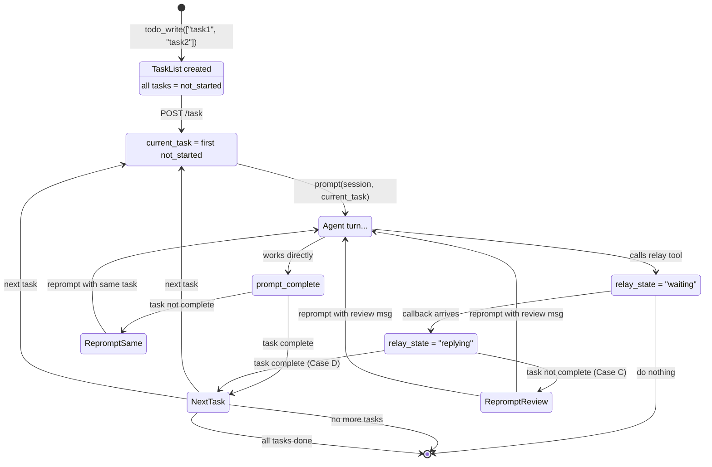

# Task Queue Design (Proper Version)

## Core Insight

The orchestrator manages a **list of tasks**, not a single task. It creates them in bulk, works through them one at a time, delegates via relay, and marks them done. The task endpoint is the orchestration layer that decides what happens on end-turn based on:
1. Relay state (Waiting / Replying / NotWaiting)
2. Task list state (which task is current, what's done)

---

## Data Model

### Task

```rust
pub enum TaskStatus {
    NotStarted,
    InProgress,
    Complete,
}

pub struct Task {
    pub title: String,    // Unique identifier within the session's task list
    pub task: String,     // The actual task description/body
    pub status: TaskStatus,
    pub created_at: String,
    pub updated_at: String,
}
```

### SQLite Schema

```sql
-- Tasks for a session (title is the primary key within a session)
CREATE TABLE session_tasks (
    session_id  TEXT NOT NULL,
    title       TEXT NOT NULL,
    task        TEXT NOT NULL,
    status      TEXT NOT NULL DEFAULT 'not_started',  -- not_started | in_progress | complete
    created_at  TEXT NOT NULL DEFAULT (datetime('now')),
    updated_at  TEXT NOT NULL DEFAULT (datetime('now')),
    PRIMARY KEY (session_id, title)
);

-- Relay state (who's waiting for a callback)
CREATE TABLE relay_state (
    session_id  TEXT PRIMARY KEY,
    state       TEXT NOT NULL,  -- "waiting" | "replying"
    updated_at  TEXT NOT NULL DEFAULT (datetime('now'))
);
```

---

## CRUD Endpoints

### Create tasks (bulk)

```
POST /api/acp/sessions/:session_id/tasks
Body: {
    "todo_list": [
        { "title": "Implement login", "task": "Add OAuth2 login flow with Google provider" },
        { "title": "Add tests", "task": "Write unit tests for auth module" }
    ]
}
```

Creates tasks with status `not_started`. Returns the full task list. Titles must be unique within the session's task list.

### Get tasks

```
GET /api/acp/sessions/:session_id/tasks
```

Returns the task list for the session. The agent reads this to know titles, tasks, and statuses.

### Update tasks (bulk)

```
POST /api/acp/sessions/:session_id/tasks/update
Body: {
    "todo_updates": [
        {
            "title": "Implement login",
            "new_task": "Add OAuth2 login flow with Google and GitHub providers",
            "new_status": "in_progress"
        },
        {
            "title": "Add tests",
            "new_title": "Write auth tests",
            "new_status": "complete"
        }
    ]
}
```

Updates one or more tasks by title. Each update can change `task`, `status`, and/or `title`. If `new_title` is provided, it must be unique (not already in the task list) or the endpoint errors.

### Delete tasks (bulk)

```
POST /api/acp/sessions/:session_id/tasks/delete
Body: { "titles": ["Add tests", "Write docs"] }
```

Deletes tasks by title. Returns the updated task list.

---

## How the Agent CRUDs

The agent gets tools (or calls HTTP endpoints) that map to the CRUD above.

**Create:**
```
todo_write(todo_list=[
    {"title": "Implement login", "task": "Add OAuth2 flow"},
    {"title": "Add tests", "task": "Unit tests for auth"}
])
→ Backend creates tasks with status not_started
→ Agent sees: [{title:"Implement login", task:"Add OAuth2 flow", status:"not_started"}, ...]
```

**Update (mark done, change title, etc.):**
```
todo_update(todo_updates=[
    {"title": "Implement login", "new_status": "complete"},
    {"title": "Add tests", "new_title": "Write auth tests", "new_task": "Write unit tests for auth module"}
])
→ Backend updates tasks by title
```

**Read:**
```
todo_read()
→ Returns current task list
```

**Delete:**
```
todo_delete(titles=["Add tests"])
→ Backend removes those tasks
```

### Task Identification

**By title.** Titles are unique within a session's task list. The agent picks meaningful titles when creating tasks and refers to them by title in updates/deletes.

---

## Task Endpoint (POST /task)

This is the main orchestration endpoint. The orchestrator calls this to start/resume task processing.

```
POST /api/acp/sessions/:session_id/task
Body: { }  -- or optional { "title": "Implement login" } to start at a specific task
```

**What it does:**

1. Load the session's task list
2. Determine the current task (first `not_started` or `in_progress`, or the specified one)
3. Prompt the session with the task description
4. Wait for turn to end
5. Apply end-turn policy (see below)
6. Loop until the agent enters Waiting state or all tasks are complete

---

## End-Turn Policy (Four Cases)

After the orchestrator's turn ends, the task endpoint checks state and decides:

### Case A: NotWaiting (no relay state)

The orchestrator hasn't delegated to a worker. It worked on the current task directly.

**Check:** Is the current task marked `complete`?
- **No:** Reprompt with the same task (continue working)
- **Yes:** Move to next task. If no more tasks, done. If next task exists, prompt with it (agent will decide to mark it in_progress).

### Case B: Waiting

The orchestrator called relay during its turn. It's waiting for a worker callback.

**Action:** Do nothing. Exit the task loop. We'll re-enter when the callback arrives (or the frontend triggers it).

### Case C: Replying (callback arrived)

The worker finished and callback arrived. The orchestrator's turn ended after receiving the callback.

**Check:** Is the current task marked `complete`?
- **No:** Reprompt with: "Worker response received. Review the results and mark the task done if complete, or delegate again if more work is needed."
- **Yes:** Dequeue next task. Prompt with it (agent decides when to mark it in_progress).

### Case D: Replying + Done (the fast path)

Same as Case C but task is already done.

**Action:** Cancel current turn (belt-and-suspenders), get next task, prompt with it.

---

## State Machine Diagram



---

## What Changes in Existing Code

### 1. `relay_session_handler` (ws.rs)

Add state tracking before spawning the relay task:

```rust
// Before tokio::spawn in relay_session_handler:
relay_state::set(&state.db.lock(), &from_session_id, "waiting");

// In the callback section (after worker finishes):
relay_state::set(&state.db.lock(), &from_session_id, "replying");
```

### 2. New files in `crow-ui-server/src/`

- **`task.rs`** — Task loop, end-turn policy, CRUD operations
- **`relay_state.rs`** — Thin SQLite wrapper for relay_state table

### 3. Router changes (ws.rs)

```rust
.route("/api/acp/sessions/:session_id/tasks", get(get_tasks_handler).post(create_tasks_handler))
.route("/api/acp/sessions/:session_id/tasks/update", post(update_tasks_handler))
.route("/api/acp/sessions/:session_id/tasks/delete", post(delete_tasks_handler))
.route("/api/acp/sessions/:session_id/task", post(task_session_handler))
```

### 4. Database migration (crow-ui-db/src/db.rs)

Migration v6 adds `session_tasks` and `relay_state` tables.

---

## Agent Tool Interface (Not MCP, just the shape)

For the agent to use this, it needs tools that call the HTTP endpoints:

| Tool | Endpoint | What it does |
|------|----------|--------------|
| `todo_write` | POST /tasks | Create tasks from array of `{title, task}` |
| `todo_read` | GET /tasks | Read current task list |
| `todo_update` | POST /tasks/update | Batch update by title |
| `todo_delete` | POST /tasks/delete | Batch delete by title |
| `task_start` | POST /task | Start/resume task processing (orchestration) |

The agent workflow:
1. `todo_write(todo_list=[{title:"Implement login", task:"Add OAuth2"}, {title:"Add tests", task:"Unit tests"}])`
2. `task_start()` → system prompts with "Implement login: Add OAuth2"
3. Agent works, maybe calls relay to delegate
4. Turn ends → system applies policy, reprompts or waits
5. Agent marks task done: `todo_update(todo_updates=[{title:"Implement login", new_status:"complete"}])`
6. Turn ends → system sees task done, moves to next, prompts with "Add tests: Unit tests"

---

## Notes

- **Task order**: Create appends to the end of the existing list. The agent can reorder via update if needed.
- **Completed tasks**: When a task is marked `complete`, it is effectively done. The GET endpoint may filter out completed tasks (or we may delete them). The agent can still read the full list if it wants to see history.
- **Agent edits current task without marking done**: The system doesn't care. It only acts on `complete` status. If the agent updates the task text or title, that's just the agent editing its own todo list. The end-turn policy only checks "is the current task complete?" — nothing else.
